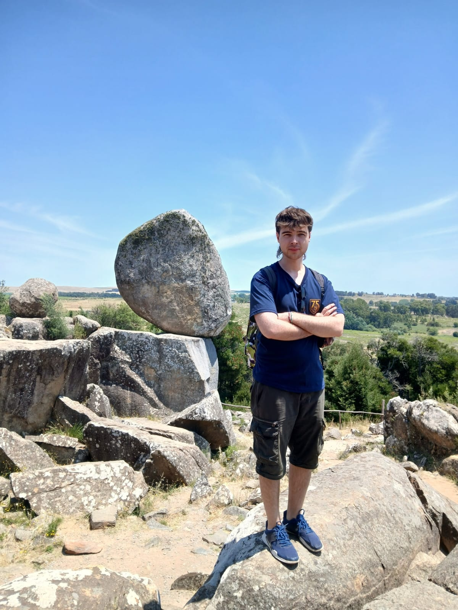

## PRESENTACIÓN

- Nombre: Lucas Iván Nakonecznyj
- Foto: 
- Legajo: 222.545-1
- Descripción: Hola a todos, me llamo Lucas y comencé a programar en el colegio en lenguaje **C** y **C++**. También realicé proyectos con [**Arduino**](https://www.arduino.cc/) y **ESP**. Tengo buenas expectativas con respecto a esta materia ya que disfruto programar y aprender cosas nuevas.